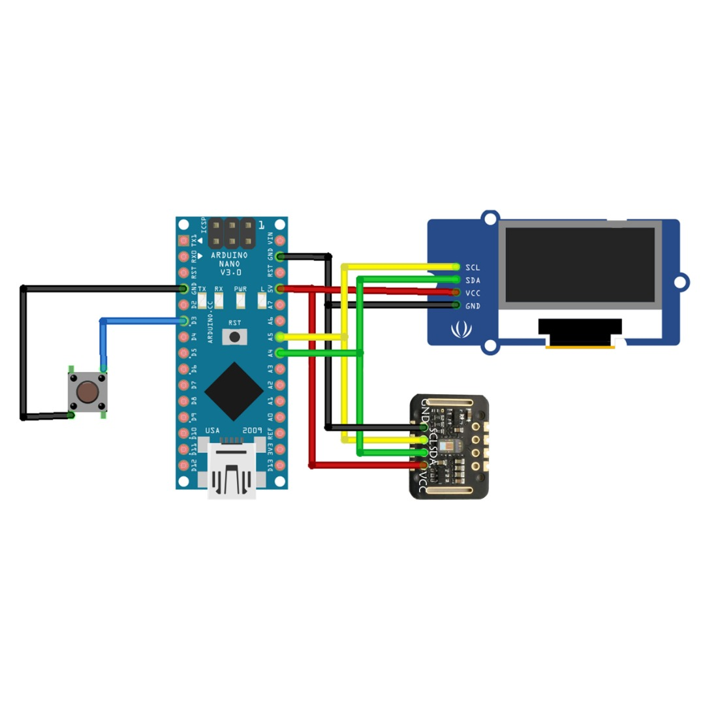
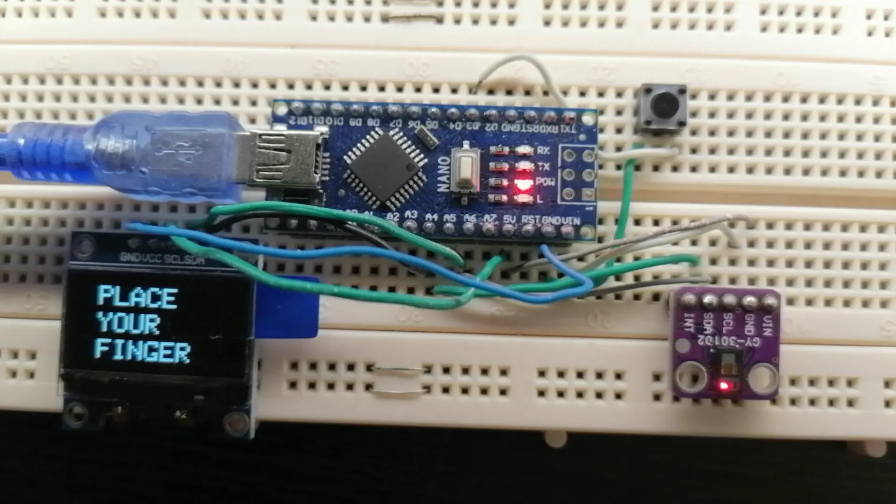
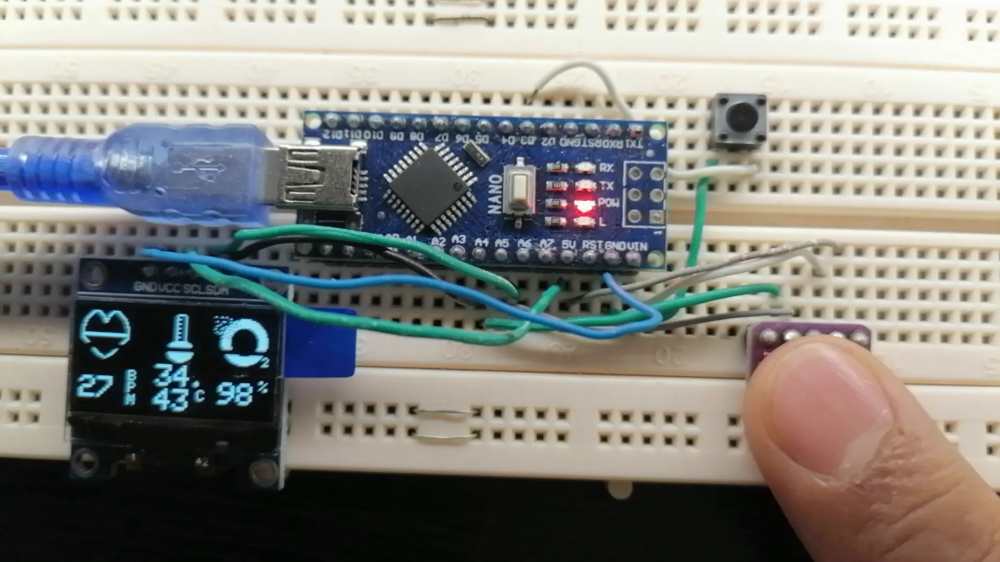
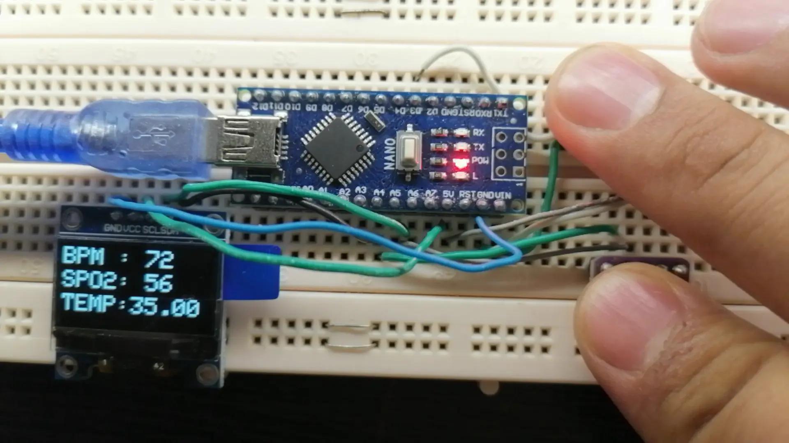
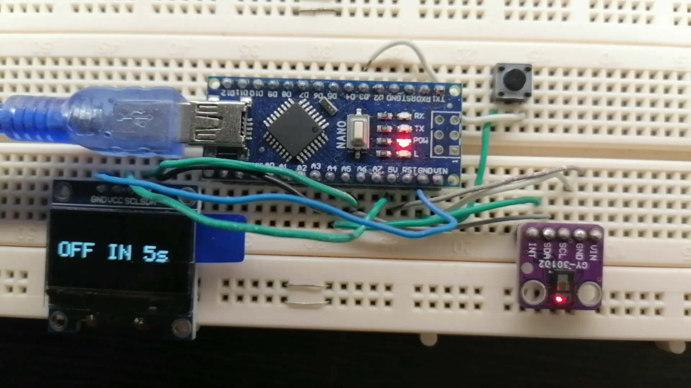
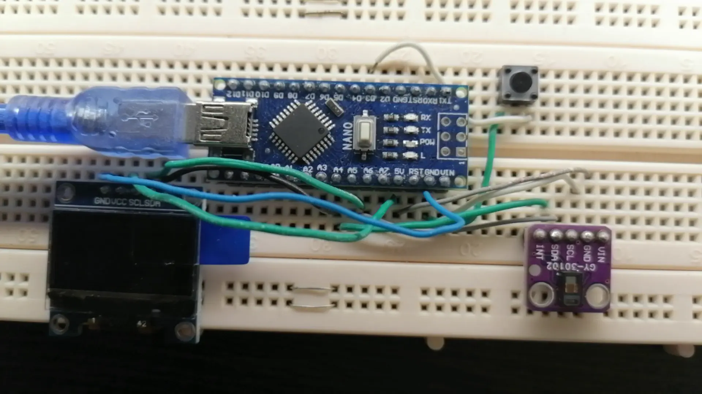

# Pulse Oximeter

A hardware and embedded systems project for monitoring **heart rate (BPM)** and **blood oxygen saturation (SpO₂)** using a pulse oximeter sensor module and microcontroller platform.

This project demonstrates real-time biomedical signal monitoring with sensor integration, embedded programming, and serial/OLED-based visualization.

---

## Features

* Real-time heart rate monitoring
* Blood oxygen saturation (SpO₂) measurement
* Embedded systems implementation
* Sensor communication using I2C
* Serial monitor data visualization
* OLED/LCD display support
* Lightweight and modular project structure
* Arduino-compatible implementation

---

## Technologies Used

* Arduino / Embedded C++
* MAX30100 / MAX30102 Pulse Oximeter Sensor
* I2C Communication Protocol
* OLED / LCD Display Modules
* Arduino IDE

---

## Hardware Requirements

* Arduino Uno / Nano / ESP32
* MAX30100 or MAX30102 Pulse Oximeter Sensor
* OLED Display (SSD1306) *(optional)*
* Jumper Wires
* Breadboard
* USB Cable

---

## Project Structure

```bash
Pulse-oximeter/
├── src/
├── libraries/
├── schematics/
├── assets/
├── images/
├── README.md
└── *.ino
```

> Folder names may vary depending on the current repository structure.

---

## Getting Started

### 1. Clone the Repository

```bash
git clone https://github.com/imanlangarann/Pulse-oximeter.git
```

### 2. Open the Project

Open the `.ino` file in the Arduino IDE.

### 3. Install Required Libraries

Install the required libraries from the Arduino Library Manager:

* Adafruit GFX
* Adafruit SSD1306
* MAX30100 Pulse Oximeter Library
* Wire

### 4. Connect the Hardware

Typical I2C wiring:

| Sensor Pin | Arduino Pin |
| ---------- | ----------- |
| VCC        | 3.3V / 5V   |
| GND        | GND         |
| SDA        | A4          |
| SCL        | A5          |

> Pin configuration may differ depending on your board.

### 5. Upload the Code

* Select your board and COM port
* Upload the sketch
* Open the Serial Monitor

---

## How It Works

The pulse oximeter sensor measures variations in blood flow using infrared and red LEDs. The embedded software processes these signals to estimate:

* Heart rate (beats per minute)
* Oxygen saturation percentage (SpO₂)

The measured data can then be displayed on:

* Serial Monitor
* OLED Display
* LCD Modules

---

## Example Output

```bash
Heart Rate: 78 BPM
SpO2: 98%
```

---

## Schematic



---

## Pictures








---

## Applications

* Biomedical engineering projects
* Health monitoring systems
* IoT healthcare prototypes
* Embedded systems learning
* Arduino sensor integration practice

---

## Future Improvements

* Bluetooth / WiFi connectivity
* Mobile app integration
* Data logging and analytics
* Real-time cloud monitoring
* Battery-powered portable design
* Improved signal filtering

---

## Disclaimer

This project is intended for **educational and research purposes only** and should not be used as a certified medical device.

---

## Contributing

Contributions, improvements, and suggestions are welcome.

1. Fork the repository
2. Create a feature branch
3. Commit your changes
4. Open a pull request

---

## Repository

[Pulse-oximeter Repository](https://github.com/imanlangarann/Pulse-oximeter)
